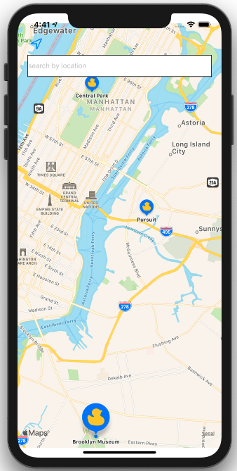

# MapKitDemo

Using MapKit. In this app we search the map and animate to a region. We also customize the MKMarkerAnnoatationView. 



## 1. Show the user's location 

The user's location will only show on the map view if location services is authorized. 

```swift 
// attempt to show the user's location if location services is authorized
mapView.showsUserLocation = true
```

## 2. Configure a MKUserTrackingButton on the map

```swift 
private var userTrackingButton: MKUserTrackingButton!
```

```swift 
userTrackingButton = MKUserTrackingButton(frame: CGRect(x: 20, y: 20, width: 44, height: 44))
mapView.addSubview(userTrackingButton)
userTrackingButton.mapView = mapView
```

## 3. Center the map view at a given coordinate

```swift 
mapView.setCenter(coordinate, animated: true)
```

## 4. Center the map view at a given MKCoordinateRegion 

```swift 
let region = MKCoordinateRegion(center: coordinate, latitudinalMeters: 1600, longitudinalMeters: 1600)
mapView.setRegion(region, animated: true)
```

## 5. Using CoreLocation to get the coordinate for a given place name 

```swift 
public func convertPlaceNameToCoordinate(addressString: String, completion: @escaping (Result<CLLocationCoordinate2D, Error>) -> ()) {
  // coverting an address to a coordinate
  CLGeocoder().geocodeAddressString(addressString) { (placemarks, error) in
    if let error = error {
      print("geocodeAddressString: \(error)")
      completion(.failure(error))
      return
    }
    if let firstPlacemark = placemarks?.first,
      let location = firstPlacemark.location {
      print("place name coordinate is \(location.coordinate)")
      completion(.success(location.coordinate))
    }
  }
}
```


## 5. Customize MKMarkerViewAnnoation 

```swift 
func mapView(_ mapView: MKMapView, viewFor annotation: MKAnnotation) -> MKAnnotationView? {
  guard annotation is MKPointAnnotation else { return nil }

  let identifier = "annotationView"
  var annotationView = mapView.dequeueReusableAnnotationView(withIdentifier: identifier) as? MKMarkerAnnotationView

  if annotationView == nil {
    annotationView = MKMarkerAnnotationView(annotation: annotation, reuseIdentifier: identifier)
    annotationView?.canShowCallout = true
    annotationView?.glyphTintColor = .systemYellow
    annotationView?.markerTintColor = .systemBlue
    //annotationView?.glyphText = "iOS 6.3"
    annotationView?.glyphImage = UIImage(named: "duck")
  } else {
    annotationView?.annotation = annotation
  }
  return annotationView
}
```
